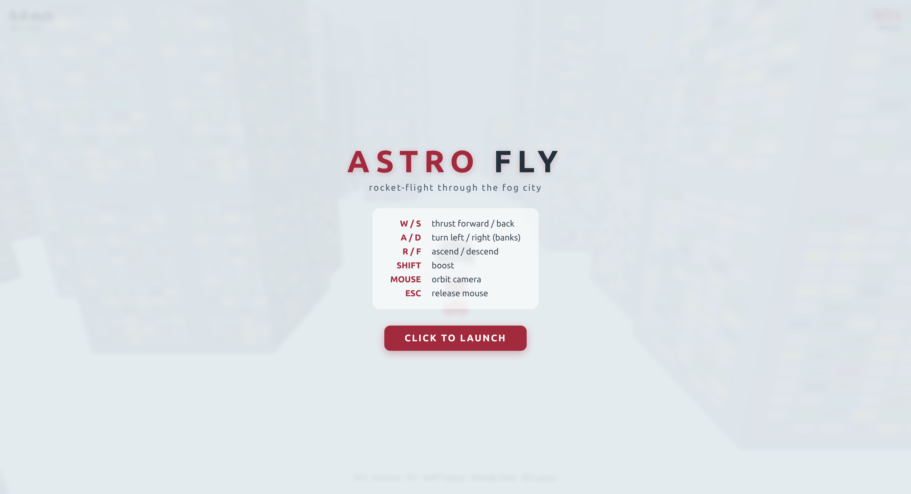
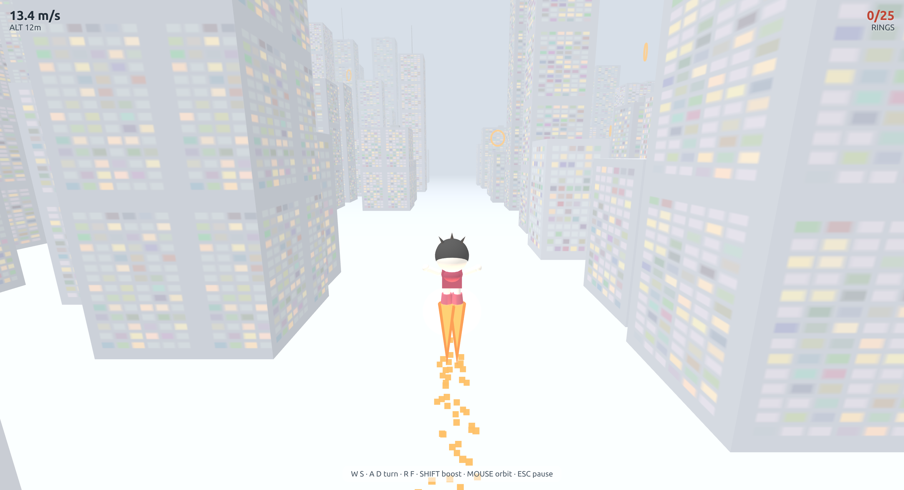
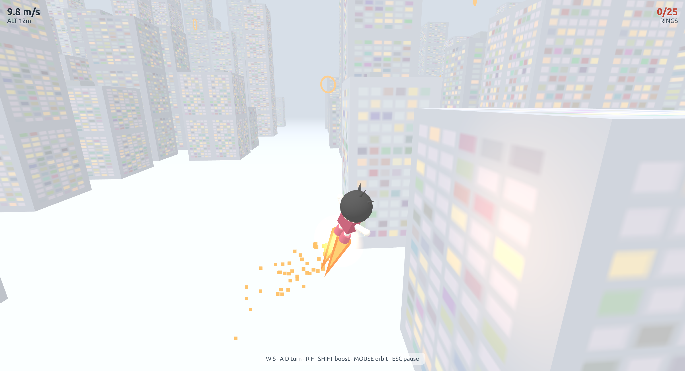

# ASTRO FLY

A third-person rocket-flying prototype for the browser — a recreation of
[ShawnTheMiller's Astro-Boy flight prototype](https://x.com/ShawnTheMiller/status/2093596563180237081)
built with [three.js](https://threejs.org/) (no build step, no dependencies).



## Screenshots

| Cruise | Boost + banked turn |
| --- | --- |
|  |  |

## Play

Open `index.html` in any modern browser (or just open this repo on
[GitHub Pages](https://pages.github.com) — it's static, so it works as-is).

### Controls

| Key | Action |
| --- | --- |
| **W / S** | Thrust forward / back |
| **A / D** | Turn left / right (auto-banks) |
| **R / F** | Ascend / descend |
| **SHIFT** | Boost |
| **MOUSE** | Orbit camera (click the page to lock) |
| **WHEEL** | Zoom camera in / out |
| **ESC** | Release mouse |

Fly through the foggy low-poly city and collect all **25 rings**.

## Features

- Chibi Astro-Boy character with signature black hair spikes, spread-wing pose,
  and solid orange rocket flames with a spark trail
- Foggy, high-key pastel city: ~180 procedurally generated towers with lit
  window textures, rooftop clutter, antenna spires, and a central flight corridor
- Flight model: heading-relative thrust, yaw turns with bank, vertical control,
  boost, drag and speed caps
- Orbiting chase camera with pointer-lock, zoom, and building collision
- Building + ground collision, ring collection with HUD (speed / altitude / rings)

## Repo layout

```
index.html              # loads the game (HTML/CSS + script tags only)
js/
  config.js             # all tuning constants (colours, physics, camera, ...)
  scene.js              # renderer, scene, fog, lights, ground
  city.js               # procedural city + window textures
  player.js             # chibi astro-boy, flames, glow, spark trail
  physics.js            # flight model + collision
  effects.js            # flame / glow / spark VFX updates
  rings.js              # collectible rings
  input.js              # keyboard, pointer-lock mouse orbit, wheel zoom
  camera.js             # orbiting chase camera
  hud.js                # speed / altitude / ring HUD
  main.js               # game loop + resize
lib/three.min.js        # vendored three.js r149
docs/screenshots/       # screenshots used in this README
reference/
  proto.mp4             # the original prototype video (the reference)
  frames/               # frames extracted from proto.mp4 (1 fps)
tools/
  cdp_helper.py         # Chrome DevTools Protocol helper (dev/test only)
  record_demo.py        # scripted-demo screencast recorder (dev/test only)
.venv/                  # Python venv for the tools (gitignored)
```

The scripts are plain (non-module) classic scripts loaded in dependency
order, so they share a single global scope — this keeps the game trivially
hostable as static files (no bundler, no CORS/module restrictions) while
still being cleanly separated by concern.

## Development / testing notes

The game was verified by driving a headful Chrome over the DevTools Protocol:
`tools/cdp_helper.py` connects to `127.0.0.1:9222`, injects keyboard events,
and captures screenshots; `tools/record_demo.py` records a scripted flight via
CDP screencast. Serve the repo root locally with:

```bash
python3 -m http.server 8000
# then open http://127.0.0.1:8000
```

A full 60 fps recording of a scripted flight can be produced with
`record_demo.py` on a machine where Chrome composites at display refresh rate
(this authoring environment composites at only a few fps, so the README uses
still screenshots instead of a choppy video).

## Credits

- Inspired by the prototype in the X post above (original by ShawnTheMiller).
- three.js by the [three.js authors](https://github.com/mrdoob/three.js) (MIT).
